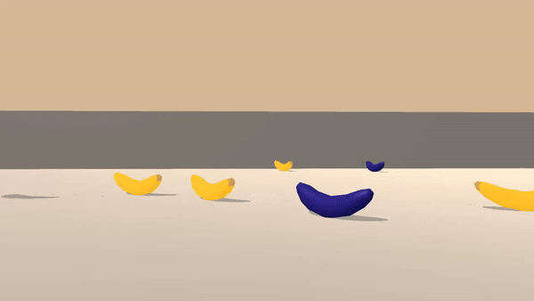

# Project: Navigation
---
 ## Overview
 
 This project is a an implementation of a Q-Learning agent to solve a game where we need to collect yellow bananas while avoiding blue bananas. The Agent and QNetwork was modeled from the DQN [Agent](https://github.com/udacity/deep-reinforcement-learning/blob/master/dqn/solution/dqn_agent.py) and [model](https://github.com/udacity/deep-reinforcement-learning/blob/master/dqn/solution/model.py) in the Deep Q Network Udacity assigment.

 A reward of +1 is given for collecting a yellow banana, and a reward of -1 is given for collecting a blue bananna. 
 
The state space has 37 dimensions and contains the agent's velocity, along with ray-based perception of objects around the agent's forward direction. Given this information, the agent has to learn how to best select actions. Four discrete actions are available, corresponding to:

    0 - move forward.
    1 - move backward.
    2 - turn left.
    3 - turn right.
    
The task is episodic, and in order to solve the environment, your agent must get an average score of +13 over 100 consecutive episodes.

 ## Getting Started

 There are two ways to interact and run the project:

 * [Navigation.ipynb](./Navigation.ipynb) -- This Jupyter Notebook is used to train the Agent and save the weights to the `model.pt` file. This file will play the banana game for 1000 iterations, learning as it goes. Once it has completed the 1000 iterations it will solve the weights to the aformentioned `model.pt` file
 * [NavigationSolved.ipynb](./NavigationSolved.ipynb) -- This Jupyter Notebook is used to play back the trained agent using the `model.pt` file. This file will open the `model.pt` file and run it 100 times, then print out the average score of the runs as well as a plot of the runs.

 ### Dependencies
 In order to run the project you will need several things installed
 * Python 3+
 * A DRNLD Configured environment [Instructions here](https://github.com/udacity/deep-reinforcement-learning#dependencies)
 * A way to run Jupiter Notebooks like VSCode
 * The Unity environment of the banana game (*Once you've downloaded the appropriate zip file, place the contents of zip file at the root of this project.*) 
    * Linux: [click here](https://s3-us-west-1.amazonaws.com/udacity-drlnd/P1/Banana/Banana_Linux.zip)
    * Mac OSX: [click here](https://s3-us-west-1.amazonaws.com/udacity-drlnd/P1/Banana/Banana.app.zip)
    * Windows (32-bit): [click here](https://s3-us-west-1.amazonaws.com/udacity-drlnd/P1/Banana/Banana_Windows_x86.zip)
    * Windows (64-bit): [click here](https://s3-us-west-1.amazonaws.com/udacity-drlnd/P1/Banana/Banana_Windows_x86_64.zip)
  
 #### Running the agent
 After you have done the above steps, you can either open the `Navigation.ipynb` or the `NavigationSolved.ipynb` file and follow the embedded instructions within.
 * `Navigation.ipynb` Will retrain the model weights and then run the game
 * `NavigationSolved.ipynb` Will run the weights provided by `model.pt` 100 times and show the plot distribution of scores

### Details

See the discription in the [Report.md](./Report.md)