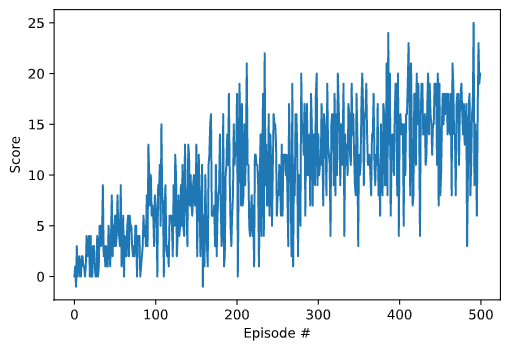

# Navigation Project Report

For instructions to run see [README.md](./README.md)

## Implementation Details

The Project consists of three main files as well as 

    - Agent.py          -- Implementation of a Deep Q Learning Agent
    - Model.py          -- Q Network Mdoel
    - ReplayBuffer.py   -- Double ended Queue with random sampling methods to store the learning experniences

### Learning Algorithm

### Hyper Parameters

### Nerual Network

## Plot
 
 > Episode 100	Avg Score: 3.37
 > Episode 200	Avg Score: 7.37
 > Episode 300	Avg Score: 10.81
 > Episode 400	Avg Score: 12.96
 > Episode 500	Avg Score: 15.01
 > Environment solved in 400 episodes.	Avg Score: 15.01
 

## Future work