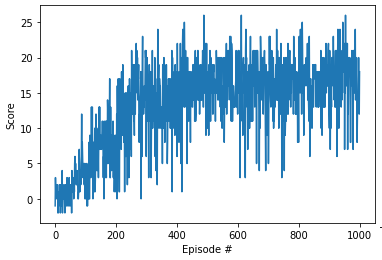
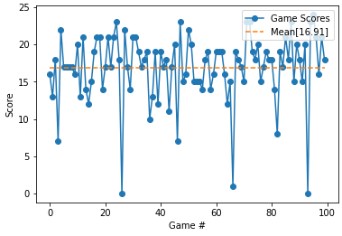

# Navigation Project Report

For instructions to run see [README.md](./README.md)

## Implementation Details

The Project consists of three main files as well as 

    - Agent.py          -- Implementation of a Deep Q Learning Agent
    - Model.py          -- Q Network Mdoel
    - ReplayBuffer.py   -- Double ended Queue with random sampling methods to store the learning experniences

### Learning Algorithm

### Hyper Parameters

### Nerual Network

## Plot
 The figure below is the plot of the rewards over runs during the training episodes

 
 > * Episode 100	Avg Score: 1.65
 > * Episode 200	Avg Score: 6.46
 > * Episode 300	Avg Score: 12.69
 > * Episode 400	Avg Score: 13.73
 > * Episode 500	Avg Score: 15.76
 > * Episode 600	Avg Score: 16.02
 > * Episode 700	Avg Score: 15.91
 > * Episode 800	Avg Score: 15.76
 > * Episode 900	Avg Score: 16.45
 > * Episode 1000	Avg Score: 16.73
 > * Agent Trained in 1000 episodes.	Avg Score: 16.73
 
 Running the Agent 100 times, once the environment was solved

 
 > * Average Score: 16.91

## Future work